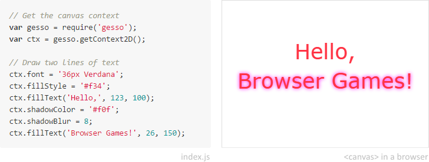

Gesso.js
========

Gesso lets you create [&lt;canvas&gt;][] applications for the browser using
the powerful server-side tools you're used to, such as [npm][]
and [require()][], all without writing any HTML or CSS.


What?
-----

Gesso is a command-line tool that:

- **Builds** your project on-the-fly so you can see changes immediately
- **Eliminates boilerplate** by running the result in a canvas on `localhost`
- Lets you **deploy** by **adding a single** `<script>` element to your website

Gesso also includes an optional base library, and a plugin system to handle
ambitious canvas projects.




Why?
----

Sometimes you just want to [make good art][] in the browser. And that
inspiration shouldn't be wasted on boilerplate or build details.


Installation
------------

```bash
$ npm install -g gesso
```


Usage
-----

1. Initialize a new package and add the Gesso runtime as a dependency:

    ```bash
    $ npm init
    $ npm install -S gesso
    ```

2. Create a new `index.js` file and add your code. For example:

    ```js
    // Get the canvas context
    var gesso = require('gesso');
    var ctx = gesso.getContext2D();

    // Draw two lines of text
    ctx.font = '36px Verdana';
    ctx.fillStyle = '#f34';
    ctx.fillText('Hello,', 123, 100);
    ctx.shadowColor = '#f0f';
    ctx.shadowBlur = 8;
    ctx.fillText('Browser Games!', 26, 150);
    ```

  *Note: Check out the [hello example][] for a complete project for this code.*

3. Build, serve, and watch for changes:

    ```bash
    $ gesso server
    version: 0.9.0
     * Running on http://localhost:63550/
     * Watching for changes
    ```

    Now visit [http://localhost:63550](http://localhost:63550/) to see it in action.


Commands
--------

The command-line interface provides commands to help you build, test, and
publish an idea quickly.

You can also type `gesso -h` for inline help.


#### serve

Builds and serves your app, rebuilding on file changes.

```bash
$ gesso serve [options]
```

*Aliases: `server`, `s`*

- `--port, -p <port>`: The port to serve on (default `63550`)
- `--host <address>`: The host to serve from (default `0.0.0.0`)


#### build

Builds your app and bundles it into the output file (dist/gesso-bundle.js by default).

```bash
$ gesso build [options]
```

*Aliases: `b`*

- `--out <path>`: The output file (default `dist/gesso-bundle.js`)


Project layout
--------------

Gesso projects are normal Node projects. The only additional requirements are:

1. You need to include `gesso` as a dependency. The CLI delegates all commands
    to the local installation so you can use different versions of Gesso in
    different projects.
2. Your project must expose an entry point. This is implicit if you create an
    `index.js` file. Or you can be explicit by providing a [main][] field.

Gesso uses [webmake][] to construct a `require()` dependency tree, including
npm-installed packages, then combines them into a single JavaScript file.
Note that native node.js modules will **not be available** to use on
the front-end. If you need them, take a look at [Browserify][].


API
---

*Detailed documentation is currently being written and will be live by version 1.0.*

*Please take a look at [the spinning example's index.js][spinning/index.js] for now.*


Deploying
---------

1. Build your project

    ```bash
    $ gesso build
    ```

2. Move the generated `dist/gesso-bundle.js` to your website

3. Add the following on your page where you want your project to be rendered:

    ```html
    <canvas id="gesso-target"></canvas>
    ```

  *Note: If this is the only canvas on the page, then you can omit the `id`.*

4. Add the following just above the `</body>` close tag:

    ```html
    <script src="gesso-bundle.js"></script>
    ```


Contributing
------------

1. Check the open issues or open a new issue to start a discussion around
  your feature idea or the bug you found
2. Fork the repository, make your changes, and add yourself to [authors.md][]
3. Send a pull request

If your PR has been waiting a while, feel free to [ping me on Twitter][twitter].

Use this software often? Please consider supporting me on
<a href="http://gratipay.com/joeyespo" target="_blank" title="Thank you!">
  
</a>


[&lt;canvas&gt;]: http://en.wikipedia.org/wiki/Canvas_element
[npm]: http://npmjs.org
[require()]: http://nodejs.org/api/modules.html
[make good art]: http://www.youtube.com/watch?v=ikAb-NYkseI
[hello example]: examples/hello/
[main]: http://npmjs.org/doc/files/package.json.html
[webmake]: http://github.com/medikoo/modules-webmake
[browserify]: http://github.com/substack/node-browserify
[examples]: https://github.com/gessojs/gessojs/tree/master/examples
[spinning/index.js]: http://github.com/gessojs/gessojs/blob/master/examples/spinning/index.js
[authors.md]: AUTHORS.md
[twitter]: http://twitter.com/joeyespo
