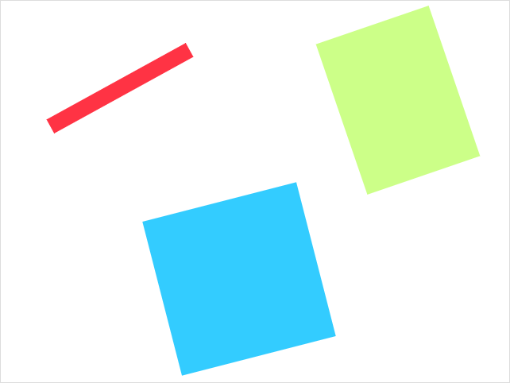

Spinning - Gesso Example
========================

Renders a set of spinning rectangles to demonstrate how to do basic animation.


Installation
------------

Make sure Gesso is installed

```bash
$ npm install -g gesso
```

Install dependencies

```bash
$ npm install
```


Running
-------

```bash
$ gesso serve
```

Now visit [http://localhost:63550](http://localhost:63550/).


Screenshot
----------




[the Gesso README]: ../../README.md
